# Current Architecture

Evidence basis: Kamiya branch `kamiya/m3-task-automation-classification`; Cerbanimo branch `kamiya/m2-task-automation-classification`. This file describes current repository behavior, not intended future behavior unless labeled as such.

## 1. System Context

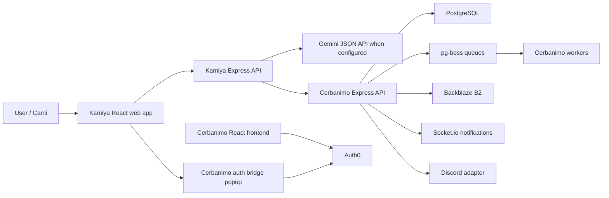

### Subsystem Summary

| Subsystem | Owner | Entrypoints | Persistence | Services/modules | Auth boundary | Execution mode | Failure behavior | Risks or contradictions |
| --- | --- | --- | --- | --- | --- | --- | --- | --- |
| Kamiya web | Kamiya | [src/App.tsx](../../src/App.tsx) :: `App` | Browser storage for auth/session; Cerbanimo for saved chats | [src/lib/kamiyaApi.ts](../../src/lib/kamiyaApi.ts), [src/lib/authBridge.ts](../../src/lib/authBridge.ts) | Cerbanimo Auth0 bridge token is passed to Kamiya API | Synchronous browser requests | Shows thrown API error as assistant message | Client carries bearer token to Kamiya API; service-token strategy still unresolved. |
| Kamiya API | Kamiya | [server/index.ts](../../server/index.ts) :: `/api/chat/turn`, `/api/chats/*`, `/api/adapters/*` | None durable except via Cerbanimo chat endpoints | [server/services/chatService.ts](../../server/services/chatService.ts), [server/services/cerbanimoClient.ts](../../server/services/cerbanimoClient.ts) | Trusts auth context supplied by browser/channel request | Synchronous | Express error handler returns `{ ok:false,error }` | Channel signatures are configurable but not enforced by default in Render env. |
| Cerbanimo API | Cerbanimo | `backend/server.js` route registration | PostgreSQL | `backend/routes/*`, `backend/services/*` | Auth0 JWT, scoped API tokens under `/api/v1`, route middleware | Synchronous plus queued workers | Global error handler returns nested error object | Root routes and `/api/v1` have overlapping functionality and different envelopes. |
| Workers | Cerbanimo | `backend/server.js` :: `boss.start()`, `startWorkers()`, `startEventWorker()` | pg-boss tables plus workflow/automation tables | `backend/jobs/startWorkers.js`, `backend/jobs/workers/*`, `backend/workers/eventWorker.js` | Runs inside backend process | Queued and scheduled | Logs queue start errors; many workers catch and log per job | Render blueprint has only web services, no dedicated worker service. |

## 2. Current Web Request Flow

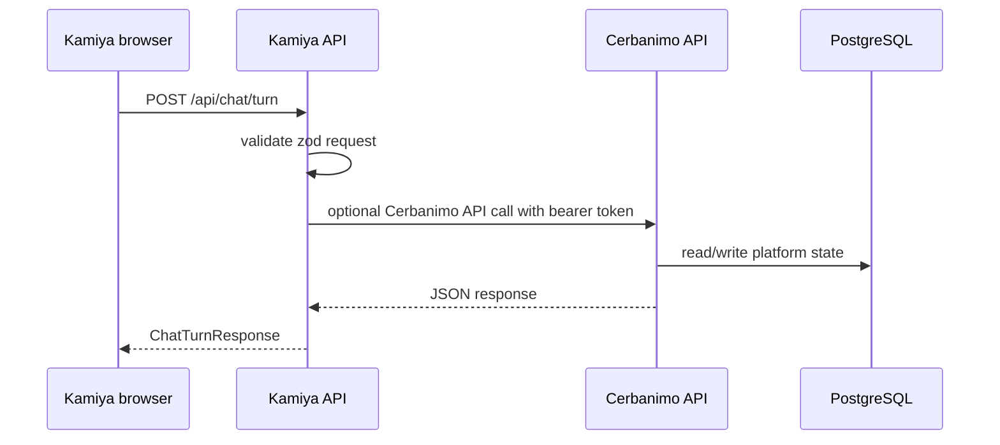

Evidence: Kamiya@69adfd2: [server/index.ts](../../server/index.ts) :: `chatTurnSchema`, `/api/chat/turn`; [src/lib/kamiyaApi.ts](../../src/lib/kamiyaApi.ts) :: `sendChatTurn()`; Cerbanimo@render-deploy ce5eca1: `backend/server.js` :: `app.use('/projects'...)`, `app.use('/tasks'...)`, `app.use('/kamiya'...)`.

Failure behavior: Kamiya API returns HTTP 400 for zod or service errors; the frontend appends the error text as an assistant message. Cerbanimo route errors are mixed: root routes often return `{ message }` or `{ error }`, while `/api/v1` and `/platform` wrap with `apiEnvelope`.

## 3. Current Kamiya Chat-Turn Flow

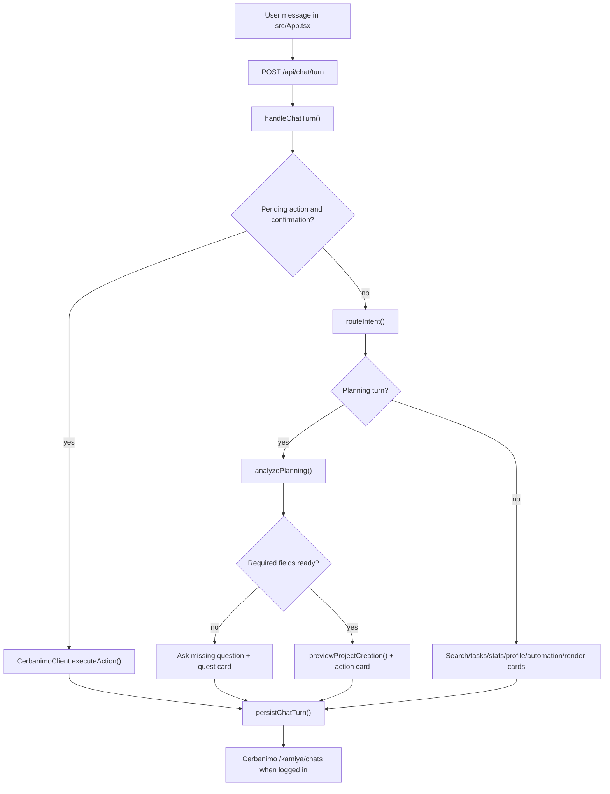

Owner: Kamiya conversation layer. Entrypoints: [src/App.tsx](../../src/App.tsx) :: `submitMessage()`, [server/index.ts](../../server/index.ts) :: `/api/chat/turn`. Persistence: Cerbanimo user row field `kamiya_chats`, created by Cerbanimo@render-deploy ce5eca1: `models/kamiya_api.js` :: `createKamiyaApiTables()`. Primary modules: [server/services/chatService.ts](../../server/services/chatService.ts), [server/services/intentRouter.ts](../../server/services/intentRouter.ts), [server/services/planningService.ts](../../server/services/planningService.ts), [server/services/actionPlanner.ts](../../server/services/actionPlanner.ts), [server/services/cardFactory.ts](../../server/services/cardFactory.ts). Auth boundary: Kamiya request carries a `KamiyaAuthContext`; Cerbanimo verifies bearer tokens when Kamiya persists chats or executes actions. Execution: synchronous request/response, with a 30-second polling loop for newly active project tasks. Failure behavior: missing Cerbanimo API credentials block mutation and return explicit text; search, tasks, profile, stats, notifications, action queue, and validation report can return mocked fallback data. Risk: action history in Kamiya session is local and not durable unless Cerbanimo `/platform` or `/api/v1` action APIs are used.

## 4. Project Creation And Task Generation Flow

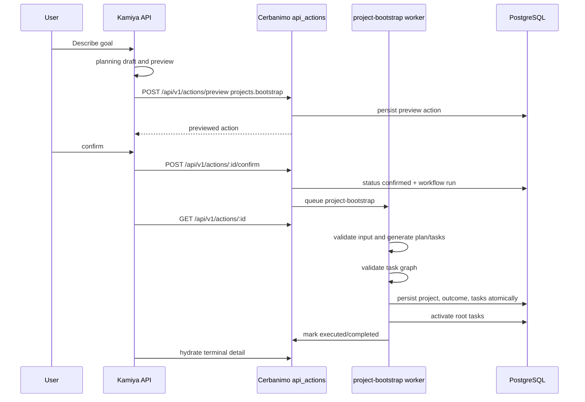

Current implementation: [server/services/cerbanimoClient.ts](../../server/services/cerbanimoClient.ts) :: `previewProjectBootstrap()`, `confirmAction()`, `hydrateProjectBootstrapAction()`; [server/services/chatService.ts](../../server/services/chatService.ts) :: `executePendingAction()`, `hydrateActionResponse()`; Cerbanimo `backend/routes/api_v1/index.js`, `backend/services/ProjectBootstrapService.js`, `backend/jobs/workers/projectBootstrapWorker.js`.

Observed behavior: project creation is previewed and confirmed as a durable Cerbanimo action. Retry, cancel, invalid graph, duplicate confirm, refresh recovery, and cross-user hydration denial are covered by real-stack browser tests. The legacy `/projects/create` plus `/projects/auto-generate` path remains in Cerbanimo for non-Kamiya surfaces but is deprecated for Kamiya's golden flow.

## 5. Task Claim, Submission, Review, Approval, Reward, Activation

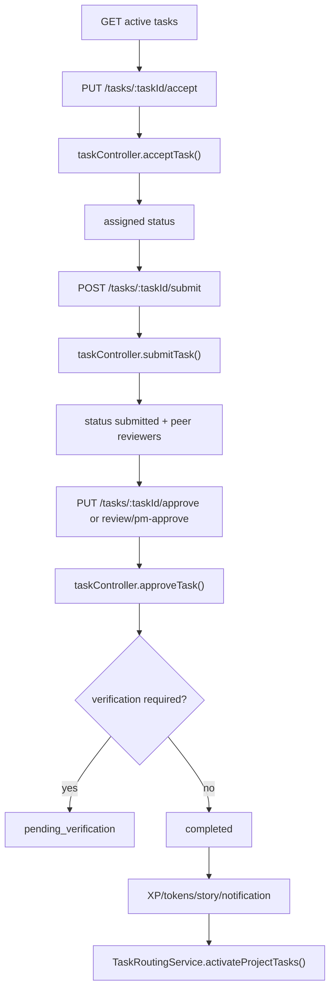

Owner: Cerbanimo. Entrypoints: Cerbanimo@render-deploy ce5eca1: `backend/routes/tasks.js` :: `router.put('/:taskId/accept')`, `router.post('/:taskId/submit')`, `router.put('/:taskId/approve')`, `router.put('/:taskId/review')`, `router.put('/:taskId/pm-approve')`. Persistence: `tasks`, `users`, `notifications`, token ledger arrays, story tables, verification tables. Primary modules: `backend/controllers/taskController.js` :: `acceptTask()`, `submitTask()`, `approveTask()`; `backend/services/TaskRoutingService.js` :: `activateProjectTasks()`. Auth boundary: `/tasks` is wrapped with Auth0 `jwtCheck` and `resolveUser` in `backend/server.js`; some route methods also require Discord-linked identity through `IdentityGateService.requireDiscordLinked()`. Execution: synchronous route work with direct DB writes and notifications; dependency activation is synchronous after approval. Failure behavior: route returns status-specific errors for missing platform user, proof links, non-submitted approval, and identity-link failures. Risk: validation and review paths are broad and complex; some validation moves tasks to `pending_verification`, but the final validation/appeal pipeline is not proven end to end from the inspected route alone.

## 6. Current Worker And Scheduling Topology

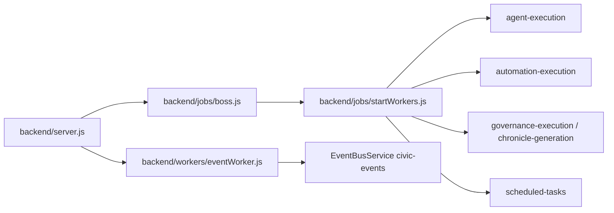

| Mechanism | Current state | Evidence |
| --- | --- | --- |
| pg-boss | Active. Queues are created, workers are started, and schedules are registered from the API process. | Cerbanimo@render-deploy ce5eca1: `backend/jobs/boss.js`, `backend/jobs/startWorkers.js`, `backend/server.js` :: `boss.start()` |
| pg-boss scheduled jobs | Active in code. Daily/monthly/hourly jobs are scheduled on startup. | `backend/jobs/startWorkers.js` :: `boss.schedule(...)` |
| Automation worker | Active in code. Processes `automation-execution` and calls `AutomationWorkerService.run()`. | `backend/jobs/workers/automationWorker.js` |
| Agent worker | Active in code. Processes `agent-execution`. | `backend/jobs/workers/agentWorker.js` |
| Domain workers | Active in code. Governance and chronicle queues. | `backend/jobs/workers/domain/domainWorkers.js` |
| Event bus | Active with pg-boss plus local fallback. | `backend/services/EventBusService.js`, `backend/workers/eventWorker.js` |
| BullMQ/ioredis | Dependency only or deprecation candidate. No active imports found outside `package.json`. | Cerbanimo@render-deploy ce5eca1: `package.json` includes `bullmq` and `ioredis`; `rg` found no active backend imports. |
| node-cron | Dependency only or deprecation candidate. Comment states scheduled tasks moved to pg-boss. | Cerbanimo@render-deploy ce5eca1: `package.json` includes `node-cron`; `backend/server.js` :: "Scheduled tasks moved to pg-boss". |
| Render worker service | Not configured. Render has backend web and frontend static services only. | Cerbanimo@render-deploy ce5eca1: `render.yaml`. |

## 7. Current AI Provider And Prompt Flow

Kamiya uses Gemini through a model-independent wrapper with deterministic fallback. Evidence: Kamiya@69adfd2: [server/ai/geminiClient.ts](../../server/ai/geminiClient.ts) :: `generateGeminiJson()`; [server/services/localIntentRouter.ts](../../server/services/localIntentRouter.ts); [server/services/planningService.ts](../../server/services/planningService.ts); [server/services/chatTitleService.ts](../../server/services/chatTitleService.ts). Prompts live in [server/ai/prompts.ts](../../server/ai/prompts.ts). Failure behavior: if `KAMIYA_GEMINI_API_KEY` is missing, `generateGeminiJson()` returns null and services use local logic.

Cerbanimo uses Gemini directly in `backend/services/taskGenerator.js` for task and project plan generation, and `backend/services/AIGatewayService.js` for agents/intelligence. Evidence: Cerbanimo@render-deploy ce5eca1: `backend/services/taskGenerator.js` :: `autoGenerateTasks()`, `autogeneratePlan()`; `backend/services/AIGatewayService.js` :: `analyze()`. Failure behavior: task generator throws and project route returns 500/502; AIGateway throws after logging.

Risk: Kamiya and Cerbanimo have separate prompt stacks and model names. Kamiya uses `KAMIYA_GEMINI_MODEL` default `gemini-3.1-flash-lite`; Cerbanimo task generator also uses `gemini-3.1-flash-lite`, while `AIGatewayService` defaults to `gemini-1.5-flash`.

## 8. Current Notification And Discord Flow

Cerbanimo owns notifications. `sendNotification()` writes to `notifications` and emits Socket.io where available. Evidence: Cerbanimo@render-deploy ce5eca1: `backend/services/NotificationService.js` :: `sendNotification()`; `backend/server.js` :: `setIo(io)` and socket rooms. Frontend notification consumption exists in `src/hooks/useNotifications.js`, `src/pages/SiteNav.jsx`, and `src/pages/NotificationProvider.jsx`.

Discord is an active integration adapter in code. Evidence: Cerbanimo@render-deploy ce5eca1: `backend/server.js` :: `IntegrationManager.registerAdapter(DiscordAdapter)`; `backend/services/integrations/adapters/DiscordAdapter.js`; `backend/routes/discord_config.js`; `backend/services/integrations/core/IntegrationManager.js`. Failure behavior: adapter logs initialization and send failures; readiness depends on Discord env/config. Risk: Kamiya has channel adapter endpoint scaffolds in [server/index.ts](../../server/index.ts) but no full bot-token implementation.

## 9. Storage And File-Upload Flow

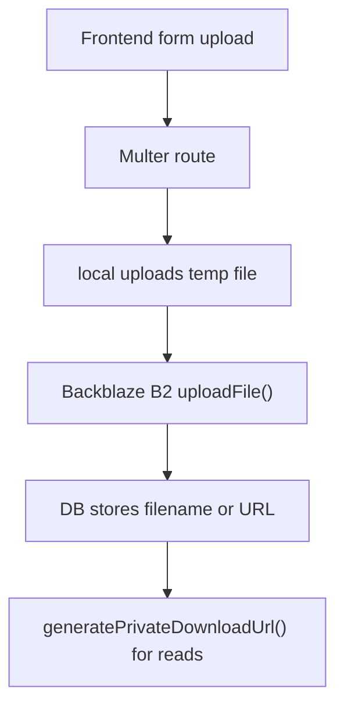

Owner: Cerbanimo. Entrypoints: Cerbanimo@render-deploy ce5eca1: `backend/routes/profile.js` :: `router.post('/', upload.single('profilePicture'))`; `backend/routes/rewards.js` :: `router.post('/badges/create')`. Persistence: file bytes in B2, filename/metadata in PostgreSQL user or reward fields. Primary service: `backend/utils/b2.js` :: `uploadFile()`, `generatePrivateDownloadUrl()`. Auth boundary: parent routes are protected by `jwtCheck` in `backend/server.js`. Execution: synchronous upload during HTTP request. Failure behavior: B2 upload error logs and returns/throws; profile update may fail if B2 fails. Risk: the repo includes committed files under `backend/uploads/**`, which contradicts a pure external-storage posture.

## 10. Deployment Topology

### Local

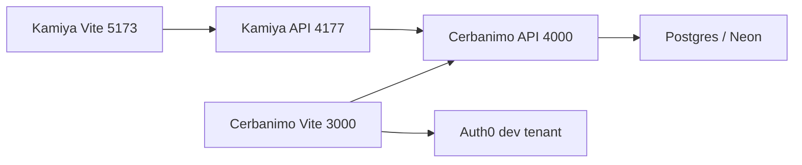

Evidence: Kamiya@69adfd2: [README.md](../../README.md) and [package.json](../../package.json) scripts; Cerbanimo@render-deploy ce5eca1: `README.md`, `backend/server.js`.

### Render

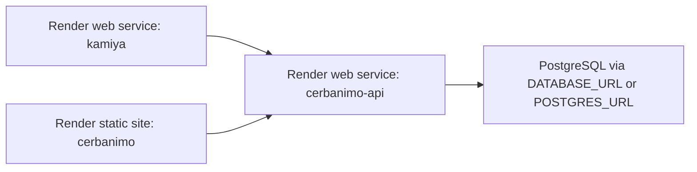

Evidence: Kamiya@69adfd2: [render.yaml](../../render.yaml); Cerbanimo@render-deploy ce5eca1: `render.yaml`. Risk: Cerbanimo workers run in the API process because no dedicated Render worker service exists. Cerbanimo `render.yaml` sets `DATABASE_URL generateValue`, while backend `server.js` requires `POSTGRES_URL`, `GEMINI_API_KEY`, and `BACKEND_URL`; `boss.js` accepts either `POSTGRES_URL` or `DATABASE_URL`.

## 11. Packet 003 Golden Conversation Delta

Evidence basis: Kamiya current branch; Cerbanimo PR #145 at `091f7ee`.

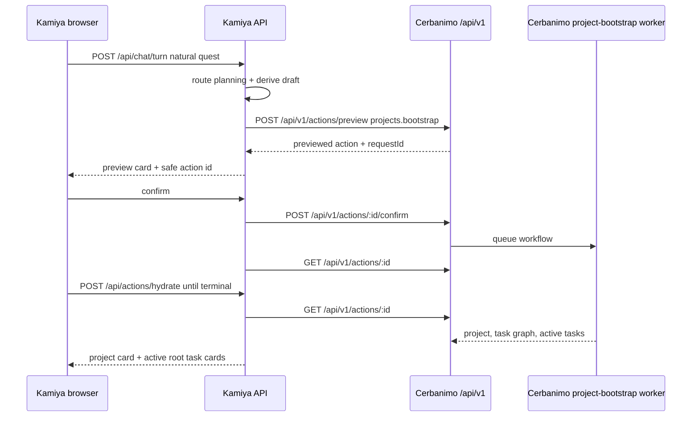

The browser stores only safe resumable identifiers in session state. The user token from the Auth0 bridge is kept in `sessionStorage`, not `localStorage`, and is never rendered into cards or URLs.

The old direct project path is deprecated for the golden flow:

- no `POST /projects/create`;
- no `POST /projects/auto-generate`;
- no `/platform` call.

The deterministic browser contract uses a local stateful Cerbanimo fixture so production Auth0, production databases, Render URLs, and live Gemini are not touched.

The isolated real-stack profile now exercises the same browser journey through a real local process group:

- Kamiya React app served by Vite;
- Kamiya Express API;
- Cerbanimo `/api/v1/actions` routes;
- isolated PostgreSQL database whose generated name contains `e2e`;
- real pg-boss queue and project-bootstrap worker;
- deterministic Cerbanimo project-bootstrap provider at the external generation seam only.

Real-stack startup is owned by [e2e/real-stack/start-real-stack.ts](../../e2e/real-stack/start-real-stack.ts). It validates the Cerbanimo dependency SHA, creates and drops only a protected e2e database, clears live Gemini keys from the test processes, seeds scoped E2E actors, and writes local artifacts to gitignored directories. The failure profile covers timeout retry, invalid graph block, cancel-before-persist, network interruption, duplicate confirmation, missing auth, and cross-user hydration denial.

## 12. Packet 004 Task Classification Delta

Evidence basis: Kamiya and Cerbanimo Packet 004 branches.

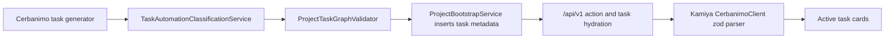

Cerbanimo now persists `automation_classification`, confidence, rationale, required human inputs, automation requirements, validation requirements, policy findings, source, version, and timestamp on `tasks`.

The normalizer is deterministic and never calls an LLM. It applies fail-closed rules before persistence, including local/physical work, binding governance decisions, financial commitments, destructive actions, unspecified credentials, and external publication without approval. Existing tasks default to `human_driven` and `legacy_default`.

`GET /api/v1/actions/:id`, `/api/v1/tasks`, and `/api/v1/tasks/:id` expose a canonical `automation` object. Kamiya parses that object, falls back malformed or missing metadata to human-driven, and renders labels plus summaries:

- `Human task`;
- `Automation-assisted`;
- `Automation-ready classification`.

Packet 004 intentionally does not execute automation. Fully automatable cards say execution capability is not connected yet, and Kamiya does not render an enabled `Automate` button.
